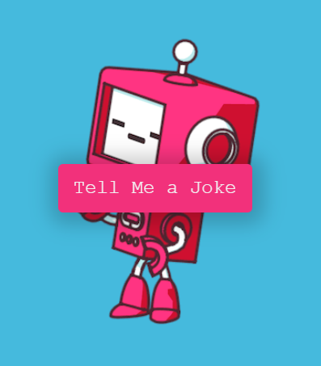

# ZTM Joke Teller

A cute robot that speek and tell joke by clicking the button "tell me a joke"

# Motivation for this project

The idea came about from the [JavaScript Web Projects: 20 Projects to Build Your Portfolio](https://academy.zerotomastery.io/p/javascript-projects). I encourage you to check it out.

# Final Output

# Getting Started

You need to have basic understanding of HTML, CSS(Flexbox), and Javascript.

# Online Tools

Icons from [Fontawesome](https://fontawesome.com/)

# Deployment

Netlify

Project [view](https://dreamwork-barel-and-yuval.github.io/joke-teller-ztm/)

+ Clone the repo and contribute if you find this useful and definitely give it a star.